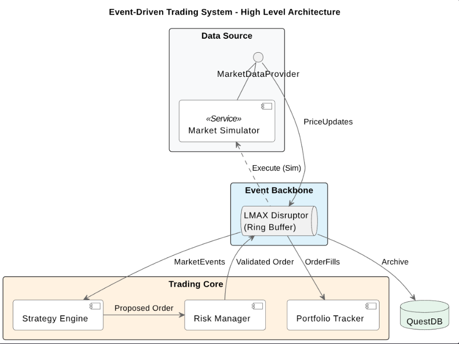
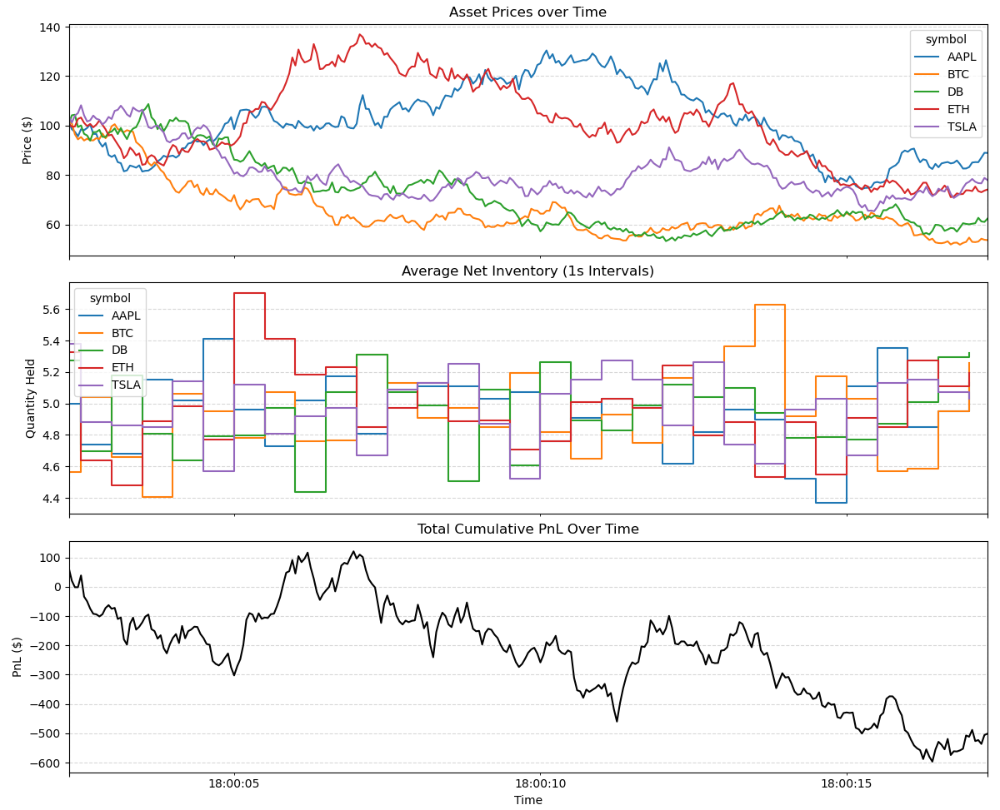
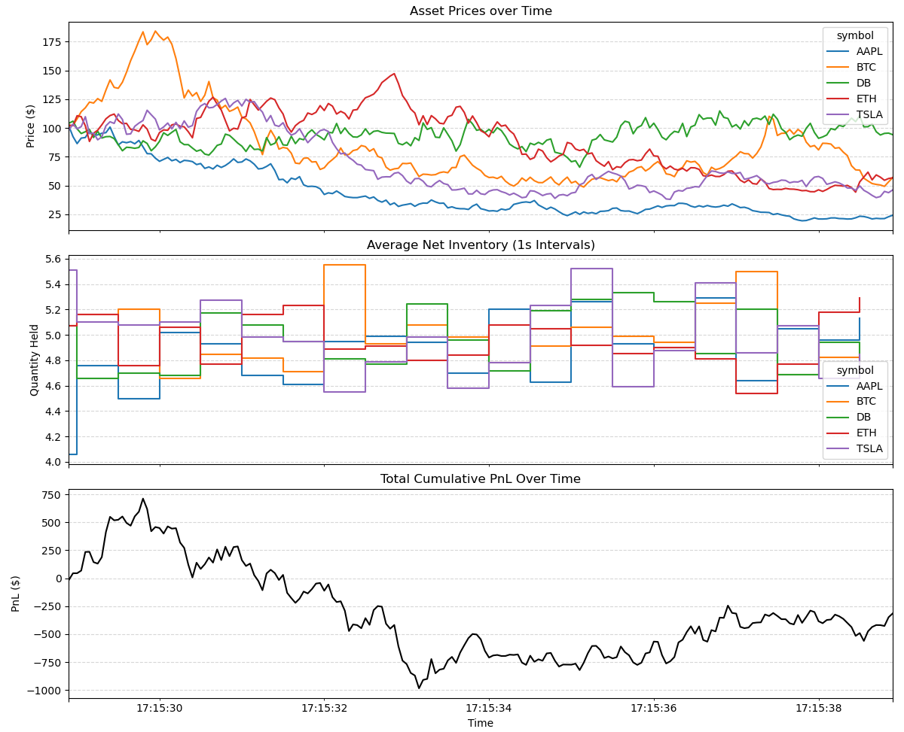

# Event-Driven Trading System

Event-driven trading system built in Java using LMAX Disruptor. Processes ~805k ticks/second with ~1.2μs latency/tick. Avoided hot path allocation and maintained separation of strategy, risk and portfolio layers.

---
## System Diagram



## Architecture

The system uses a tri-buffer Disruptor pipeline. Each handler reads from one dedicated ring buffer and writes to the next, so no handler ever publishes back into the buffer it consumes from. Making deadlock less likely.

```
MarketSimulator
      │
      ▼
 TickBuffer        (MARKET_TICK events)
      │
      ▼
StrategyHandler --> OrderBuffer       (ORDER_PROPOSED events)
                          │
                          ▼
                    RiskHandler --> FillBuffer        (ORDER_FILL events)
                                         │
                                         ▼
                                   PortfolioHandler
                                   DbLoggerHandler   (simultaneous)
```
_Event Pipeline_


### Price Model Comparison


_Session using Geometric Brownian Motion as Price Generator._


_Session using Gaussian Random Walk as Price Generator._

- _Note: Shown Data plotted using matplotlib + csv from CsvExporter._
---

## Components

### Simulation
- Market data generator with configurable stochastic models (GBM/ random walk).
- In-memory order matching using pre-allocated structures.

### Strategy
- SMA crossover engine with O(1) updates via circular buffers
- Signal generation triggered only on crossover events.

### Risk
- Rule-based validation (position limit, price deviation, drawdown guard)
- Fail-fast evaluation pipeline.

### Portfolio
- Real-time position tracking and PnL computation.
- Array based storage.

### Infrastructure
- Multi-buffer Disruptor pipeline orchestration (See Architecture).
- Benchmarking + CSV export for analysis.

---

## Running

```java
// Main
    public static void main(String[] args) throws InterruptedException {
    SystemController systemController = new SystemController();
    systemController.start();

    // Trading System execution time.
    Thread.sleep(10_000);

    systemController.stop();
}
```

### Sample Output

```
========================================
          SESSION REPORT                
========================================

--- Trade Log (showing last 5 of 1026942 fills) ---
  1026934  ETH    BUY   70.10      10.0     2026-03-27 22:15:29.971
  1026935  TSLA   SELL  58.84      10.0     2026-03-27 22:15:29.971
  1026936  ETH    SELL  70.05      10.0     2026-03-27 22:15:29.971
  1026937  TSLA   BUY   58.86      10.0     2026-03-27 22:15:29.971
  1026938  BTC    SELL  119.53     10.0     2026-03-27 22:15:29.971
 

--- Final Positions ---
  BTC    | qty:    10.00
  ETH    | qty:     0.00
  AAPL   | qty:     0.00
  TSLA   | qty:    10.00
  DB     | qty:     0.00

--- Realized PnL by Symbol ---
  BTC    | pnl:    +197.22
  ETH    | pnl:    +153.32
  AAPL   | pnl:    -424.04
  TSLA   | pnl:    -150.37
  DB     | pnl:      +0.00

--- Total ---
  Total Ticks: 16154496
  Total Fills: 1026942
  Fill Rate: 6.3570%
  Total Realized PnL: -223.87
========================================

==========================================
  Ticks processed:    16,154,496
  Fills executed:      1,026,942
  Ticks/second:        807,716
  Avg latency/tick:    1.238 µs
==========================================
```

---

## Dependencies

| Library | Version             | Purpose |
|---|---------------------|---|
| LMAX Disruptor | 4.0.0               | Lock-free ring buffer event processing |
| QuestDB | Not yet implemented | Time-series database  |

---

## Configuration

All tunable parameters are defined as constants at the top of `SystemController.java`, price generation must be configured in PriceGenerator.

## Notes

> **Planned improvements & Limitations:**
>
> - **QuestDB integration**: `DbLoggerHandler` currently records fills to in-memory `Ledger` and exports to CSV on shutdown. The `AsyncWriter`, `SchemaMapper`, and `DbBridge` stubs are in place and will be wired to a live QuestDB instance for real-time time-series persistence and post-session querying.
>
> - **Exchange API connection**: The system currently runs entirely on simulated market data via `MarketSimulator`. A real exchange adapter will replace it to consume live market feeds and route orders to an actual exchange via a broker API.
>
> - **Daily PnL reset**: `DrawdownGuard` currently checks total realized PnL since system start rather than within a daily window.
>
> - **Additional strategies**: `StrategyEngine` currently implements SMA crossover only. I will implement more strategies in the future to compare them under different market Price Models.